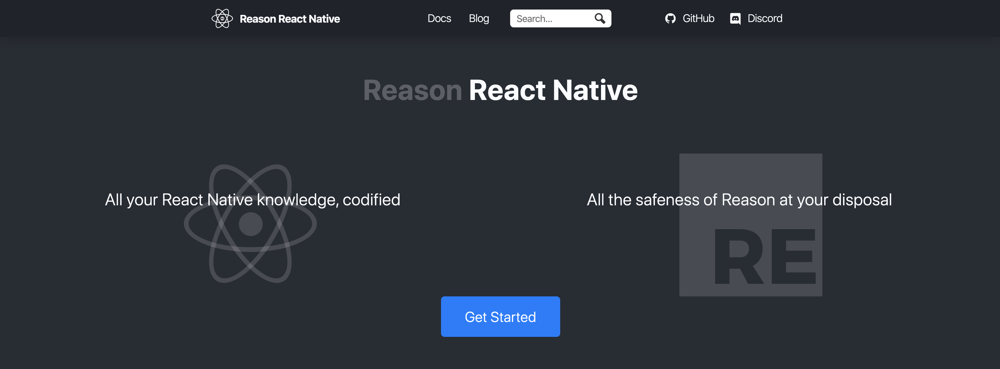
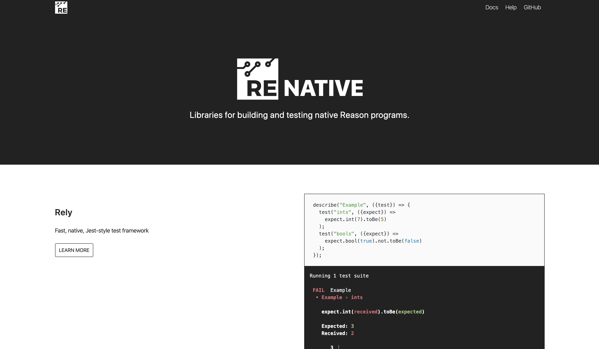
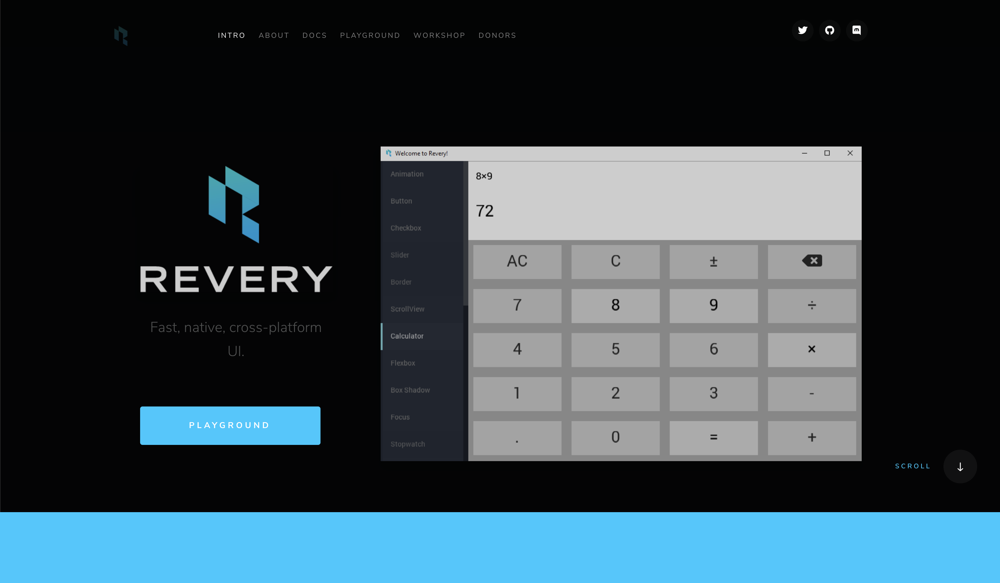
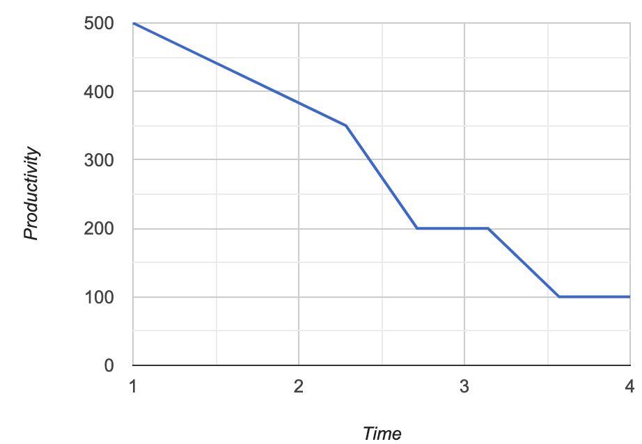
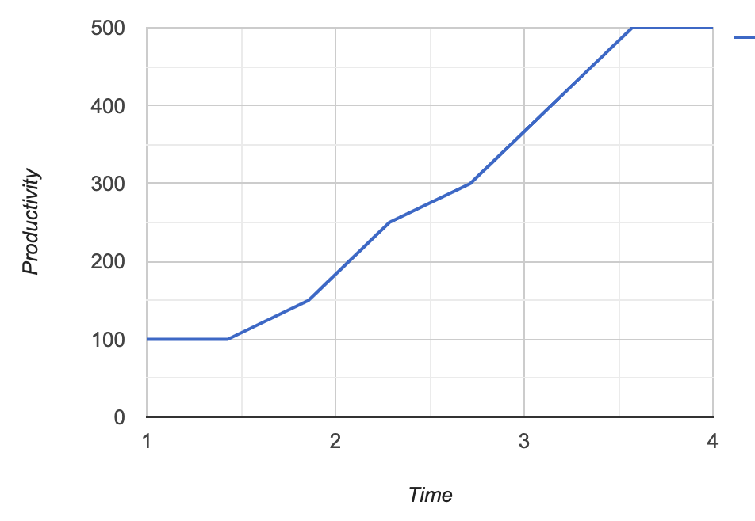
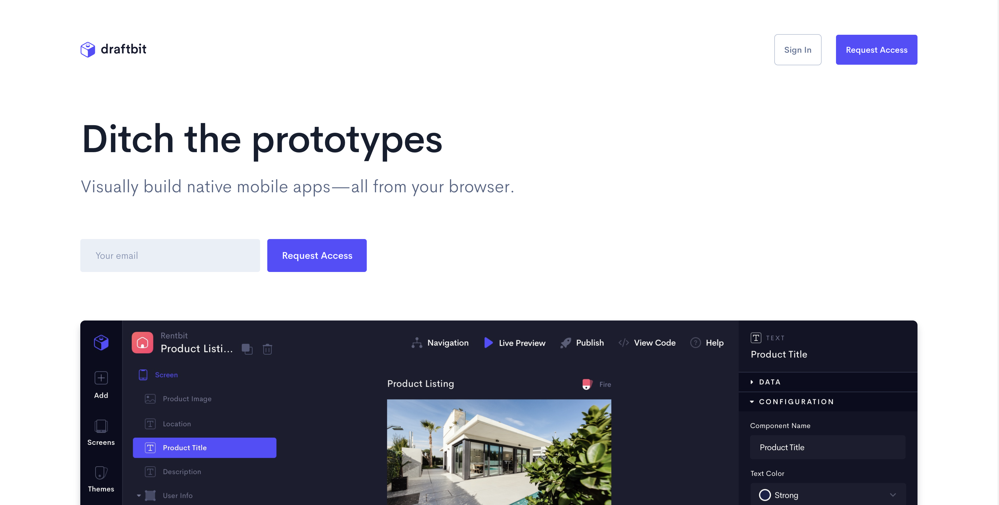

import { Image, Notes, Appear } from 'mdx-deck';
import { dark } from 'mdx-deck/themes';
import Layout, { Split } from './layout';
import codeSurfer from 'prism-react-renderer/themes/nightOwl';
export { components } from 'mdx-deck-code-surfer';

export const theme = {
  ...dark,
  codeSurfer,
  monospace: '"Dank Mono", "Fira Code", Consolas, "Roboto Mono", monospace',
  colors: {
    text: 'rgb(214, 222, 235)',
    code: 'rgb(130, 170, 255)',
    link: 'rgb(128, 203, 196)',
    background: 'rgb(1, 22, 39)',
  },
};

export default Split;


# The Frontend Language of the Future

---

export default Layout;

# What is Reason

- Statically Typed
- Functional Paradigm
- A syntax for OCaml
- Compiles down to JavaScript using BuckleScript


---

export default Layout;

# Why use Reason

- Prevents bugs from reaching production
- ES 2200 syntax!!!
- Targets Web and Native code

---

export default Layout;

## Syntax Cheatsheet

| JavaScript            | Reason                |
| --------------------- | --------------------- |
| `var str = 'string'`  | `let str = "string"`  |
| `let num = 1`         | `let num = 1`         |
| `const arr = [1,2,3]` | `let arr = [|1,2,3|]` |
| `"hello " + "world"`  | `"hello " ++ "world"` |
| `1 + 1`               | `1 + 1`               |
| `1.2 + 2`             | `1.2 +. 2.`           |
| `const {a, b} = data` | `let {a, b} = data`   |
| `null`, `undefined`   | `None`                |

---

export default Layout;

```js JavaScript Functions
const add = a => b => a + b;
const addThree = add(3);
let result = addThree(5);
```

---

```reason Reason (Currying)
let add = (a, b) => a + b;
let addThree = add(3);

let result = addThree(5);
let result2 = add(3)(5)
----
* > Currying is a built-in feature of Reason
2 > Doing this in JavaScript would result in NaN
```

---

```js JavaScript
let divide = ({dividend, divisor}) = dividend / divisor;
let result = ({dividend: 10, divisor: 2});
```

---

```reason Reason (Labeled Arguments)
let divide = (~dividend, ~divisor) => dividend / divisor;
let result = (~divisor=2, ~dividend=10);
```

---

export default Layout;

```js JavaScript
const friends = getFriends(getPerson(getId()));
```

---

```reason Reason (Pipes)
let friends = getId()
  ->getPerson()
  ->getFriends()
```

---

```reason Piping
let takeTwo = (data, second) => {};
let takeAnotherTwo = (data, third) => {};

let second = "second"
let third = "third"

let result = "data"
  -> takeTwo(second)
  -> takeAnotherTwo(third)
----
* >  Fast Pipe ->
7,8,9 > data gets assigned to the first parameter
```

---

```reason Piping
let takeTwo = (second, data) => {};
let takeAnotherTwo = (third, data) => {};

let result = "data"
  |> takeTwo(second)
  |> takeAnotherTwo(third)
----
* >  Pipe Last |>
4,5,6 > data gets assigned to the first parameter
```

---

```reason Records
type person = {
  id: string,
  name: string,
  age: int=?,
};

let gary: person = {id: 1, name: "Gary", 12};
let ash = {id: 2, name: "Ash", age: 10};
----
* > "semi-equivalent" of JS objects
1,2,3,4 > type declarations is similar to TypeScript interfaces!
7,8 > Record types can be inferred by Reason!
```

---

```reason Variants
type person =
  | Free
  | Paid
  | Admin
  | Super;

type action =
  | Save(string)
  | Cancel
  | Edit;

type tile =
  | Empty
  | Marked(person);
----
* > Variants are special data types are used in pattern-matching
8,14 > Variants can accept arguments
7,8,9,10 > In ReasonReact, action variants act similarly to action creators
```

---

export default Layout;

```js JavaScript
if (!isAdmin) {
  if (paidUser) {
    return 'Paid User';
  } else {
    return 'Free User';
  }
} else {
  if (isSuperAdmin) {
    return 'Super Admin';
  } else {
    return 'Admin';
  }
}
```

---

export default Layout;

```reason Pattern Matching
let message =
  switch (person)
  | Free => "Free User"
  | Paid => "Paid User"
  | Admin => "Admin"
  | Super => "Super Admin";

let reducer =
  switch (action)
  | Edit => {...state, isEditing: true}
  | Cancel => {...state, isEditing: false}
  | Save(text) => { text, isEditing: false };

let { first, second } = getRange();
let [ head, ...tail ] = arr;
----
* > Reason heavily utilizes patter matching instead of if/else or switch/cases
1,2,3,4,5,6 > Pattern matching is much cleaner compared to if/else
8,9,10,11,12 > Reducer functions also utilizes pattern matching
12 > "text" is the payload
14,15 > Destructuring is also an application of pattern matching
```

---

# JavaScript Interop

---

export default Layout;

```reason Using JavaScript or TypeScript in Reason
[@bs.val] external pi: float = "Math.PI";

Js.log(pi +. pi);

[@bs.val]
external getElementId: string => t =
  "document.getElementById";

let element = getElementId("root");
----
* > JavaScript can be used inside Reason
1[0:5], 5 > [@bs.val] allows you to access JS values available in global
1[6], 6[1] > external is a BuckleScript keyword that creates a variable
1, 3 > Storing Js Pi to Reason variable
5,6,7,8,9 > storing and using the getElementById fn in Reason
```

---

export default Layout;

```reason Binding npm modules to Reason
[@bs.module "isomorphic-unfetch"]
external fetch : string => Js.Promise.t('a) = "default"

fetch(url)
|> Js.Promise.then*(response =>
  Js.Promise.resolve(response##text()))
|> Js.Promise.then*(data =>
  Js.Promise.resolve(Js.log(data)));
----
* > npm modules can also be imported to Reason
1,2,3 > binding "isomorphic-unfetch"
1 > [@bs.module] is declared whenever an external file is being imported
2[2] > store default export to "fetch" variable
2[3:15] > type the variable as a fn that accepts a string and return a JS promise
4,5,6,7,8 > usage
```

---

export default Layout;

```s Using Reason in JavaScript or Typescript
npm install --save-dev bs-platform gentype
```

---

export default Layout;

```reason
[@genType]
type t = {
  id: string,
  name: string,
};

let x = 42;
----
* > genType allows Reason values and types to be used in JS or TS files
1 > [@genType] will generate a ".gen.ts" file which contains the converted Reason type to TypeScript
```

---

export default Layout;

```ts
/* TypeScript file generated by genType. */
/* eslint-disable import/first */

// tslint:disable-next-line:interface-over-type-literal
export type t = { readonly id: string; readonly name: string };
----
* > inside *.gen.ts
```

---

export default Split;

# Reason-React


---

| JS              | Reason                     |
| --------------- | -------------------------- |
| Ramda/Lodash    | <Appear>Reason ✅</Appear> |
| Eslint          | <Appear>Reason ✅</Appear> |
| React-Router    | <Appear>Reason ✅</Appear> |
| Prettier        | <Appear>Reason ✅</Appear> |
| Typescript/Flow | <Appear>Reason ✅</Appear> |

---

export default Layout;

```s Getting Started
npx bsb -init my-app -theme react-hooks
```

---

export default Layout;

```reason
[@react.component]
let (value, setValue) = React.useState(() =>
  "Hello Reason React!");
let make = () =>
  <div>
    "Hello Reason React!"->React.string
    <input
      value
      setText={event =>
        setText(ReactEvent.Form.target(event)##value)}
    />
  </div>;
----
* > React in Reason 🚀
1 > React components are declared with [@react.component]
2,3 > ReasonReact has hooks!
6 > Since Reason is strongly types, even the React children must be typed
8 > JSX props can be punned
9,10 > Typing the event object before passing the value to setText
```

---

export default Layout;

```reason Props
[@react.component]
let make = (~title="Reason React", ~id) => {
  let push = route => ReasonReactRouter.push(route);

  <div>
    <div> title->React.string </div>
    <nav>
      <a onClick={_ => push({j|/profile/$id|j})}> "Profile"->React.string </a>
      <a onClick={_ => push("/logout")}> "Logout"->React.string </a>
    </nav>
   </div>
}
----
* > Header.re
2[4:15] > All component props need to be declared
3 > Store the push fn from ReasonReactRouter to push variable
8 > Here's how to use the push fn
5,6,7,8,9,10,11 > Last expression in every fn is always returned
```

---

export default Layout;

````reason Routing
[@react.component]
let make = () => {
  let { path } = ReasonReactRouter.useUrl();
  let container =
    switch (path) {
      | [] => <Home />
      | ["pokemon"] => <PokemonList />
      | ["pokemon", id] => <PokemonPage id />
      | ["pokemon", id, "edit"] => <EditPokemonPage />
      | _ => <PageNotFound />
    };

  <>
    <Header />
    <div>
      <Sidebar />
      container
    </div>
  </>;
}
----
* > Routing is built-in in ReasonReact
6,7,8,9,10 > Routes can be easily defined
10 > _ serves as catch-all
---

export default Layout


```reason Module System
[@react.component]
let (text, setText) = React.useState(() => "Hello Reason React!");
let (userInfo) = useUserInfo();

let make = () =>
  <div>
    <Header title="FreeCodeCamp Manila!!!" id=userInfo.id />
    <input
      value=text
      setText={event =>
      setText(ReactEvent.Form.target(event)##value)} />
  </div>;
----
* > Layout.re
* > All Reason modules are "global"
7 > All declared component props must be passed down
* > This is the entire React file!!! 😲

````

---

export default Layout;

```reason Styling using bs-css
module Styles = {
  open Css;

  let card = style([
    display(flexBox),
    flexDirection(column),
    alignItems(stretch),
    backgroundColor(white),
    boxShadow(Shadow.box(~y=px(3), ~blur=px(5), rgba(0, 0, 0, 0.3))),
    unsafe("-webkit-overflow-scrolling", "touch"),
  ]);

  let title = style([
    fontSize(rem(1.5)),
  ]);

  let actionButton = disabled =>
    style([
      background(disabled ? darkgray : white),
      color(black),
      border(px(1), solid, black),
      borderRadius(px(3)),
    ])
};

<div className=Styles.card>
  <h1 className=Styles.title> (ReasonReact.stringToElement("Hello")) </h1>
  <button className=Styles.actionButton(false)>
</div>
----
* > Styling using bs-css
2 > import the values inside Css for use inside the file
4,5,6,7,8,9,10,11 > CSS is typed!!! 😎
26,27,28,29 > Usage similar to how it's done in React Native
```

---

export default Layout;

```reason Using React component from npm
module Input = {
  [@bs.module "antd"] [@react.component]
  external make:
    (
      ~disabled: bool=?,
      ~id: string=?,
      ~size: string=?,
      ~value: string=?,
      ~onChange: ReactEvent.Form.t => unit=?,
      ~onPressEnter: string => unit=?,
      ~allowClear: bool=?
    ) =>
    React.element =
    "Input";
};

[@react.component]
let make = () => {
  let (value, setValue) = React.useState(() => "");
  let handleValueChange = event => {
    setValue(ReactEvent.Form.target(event)##value));
  };
  <Input value onChange=handleValueChange />
}
----
* > React components from npm need to be bound first
4,5,6,7,8,9,10,11,12 > Props to be used need to be bound
13 > this means that the imported value is a function that returns a React component
14 > The Input component is being imported as a named import
```

---

export default Split;

# GraphQL


---

export default Layout;

```s Install GraphQL Client
yarn add reason-urql
yarn add reason-relay
yarn add reason-apollo
```

---

export default Layout;

```s Install Graphql PPX
yarn add graphql_ppx -D
yarn send-introspection-query http://my-api.example.com/api
```

---

export default Layout;

## Missing Variables


---

export default Layout;

## Missing Fields


---

export default Layout;

## Misspelled Fields


---

export default Layout;

```reason
[@bs.val] external apiUrl: string = "process.env.API_DEV";

open ReasonUrql;

let client = Client.make(~url=apiUrl, ());

ReactDOMRe.renderToElementWithId(
  <Provider value=client> <App /> </Provider>,
  "root",
);
----
* > Index.re
```

---

export default Layout;

```reason GraphQL Query
module ListPokemon = [%graphql
  {|
    query listPokemon {
      pokemon {
        name
        id
        description
        moves {
          name
        }
      }
    }
  |}
];
----
* > making a graphql query in Reason looks similar to JS
1 > "%graphql" is similar to "gql" in function
```

---

export default Layout;

```reason Making GraphQL requests
[@react.component]
let make = () => {
  let request = ListPokemon.make();
  let ({response}, _) = ReasonUrql.useQuery(~request, ());

  switch (response) {
    | Fetching => <div> "Fetching"->React.string </div>
    | NotFound => <div> "No Data"->React.string </div>
    | Error(_e) => <div> "Error ❌"->React.string </div>
    | Data(data) => {
      switch (data##listPokemon) {
      | None => <div> "No pokemon found"->React.string </div>
      | Some(listPokemon) => <PokemonList listPokemon />
    }
  }
}
----
* > Making graphql is made easy in Reason
3,4 > Making a query is straightforward
6,7,8,9,10 > Handling data from query response is made simple with pattern matching
12,13 > option type returns either None or Some('a)


```

---

# Other Targets

---



---



---



---

## Caveats

- Documentation is all over the place
  - Reason, BuckleScript, OCaml
- Learning curve is very high
- Have to bind npm packages

---

export default Layout;

## JS



---

export default Layout;

## Reason



---

export default Layout;

## Who should use this

- Startups
- Agencies
- Enterprise

---

## Notable Users

---


---


---



---


---


---

Thank you! 😌

---

Questions? 🤔

---
